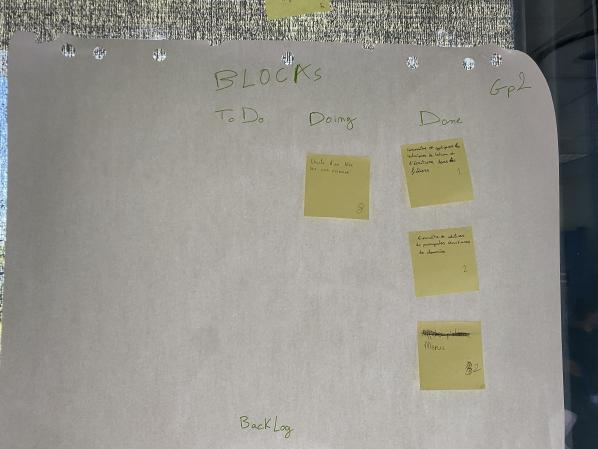
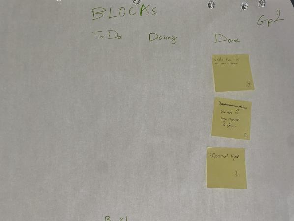
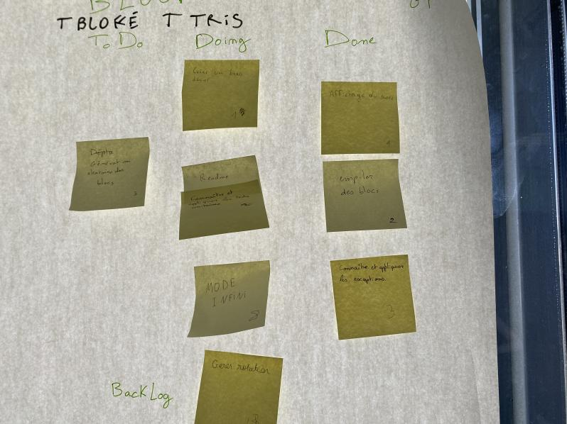
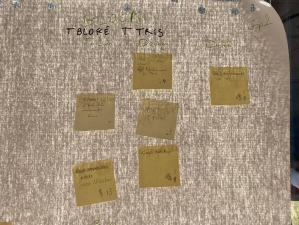
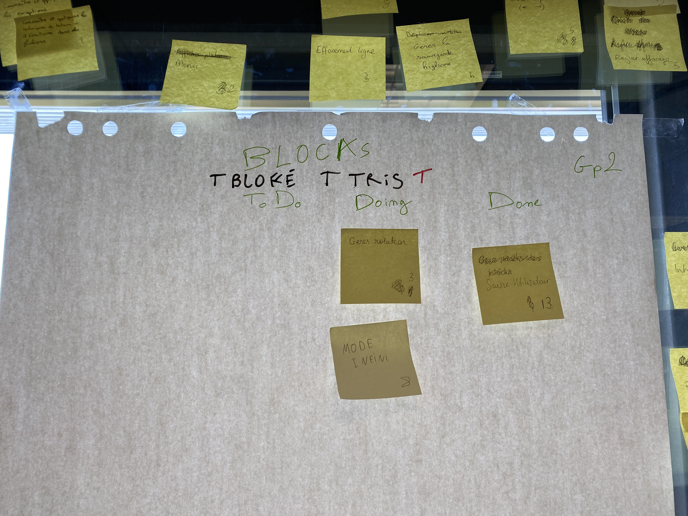
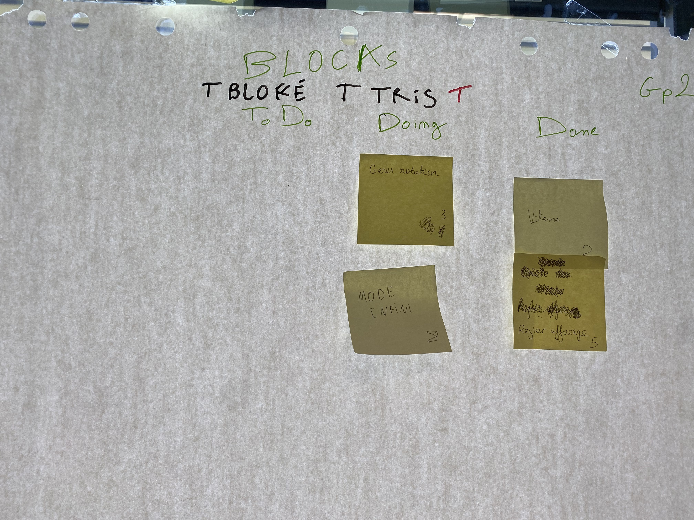
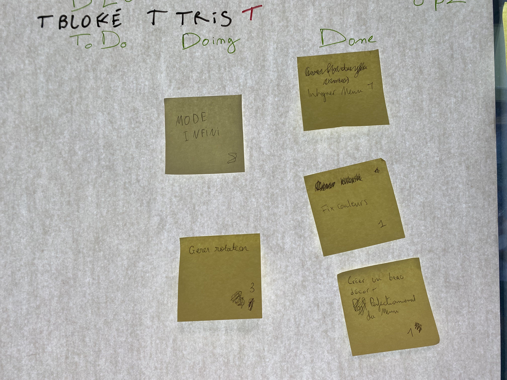
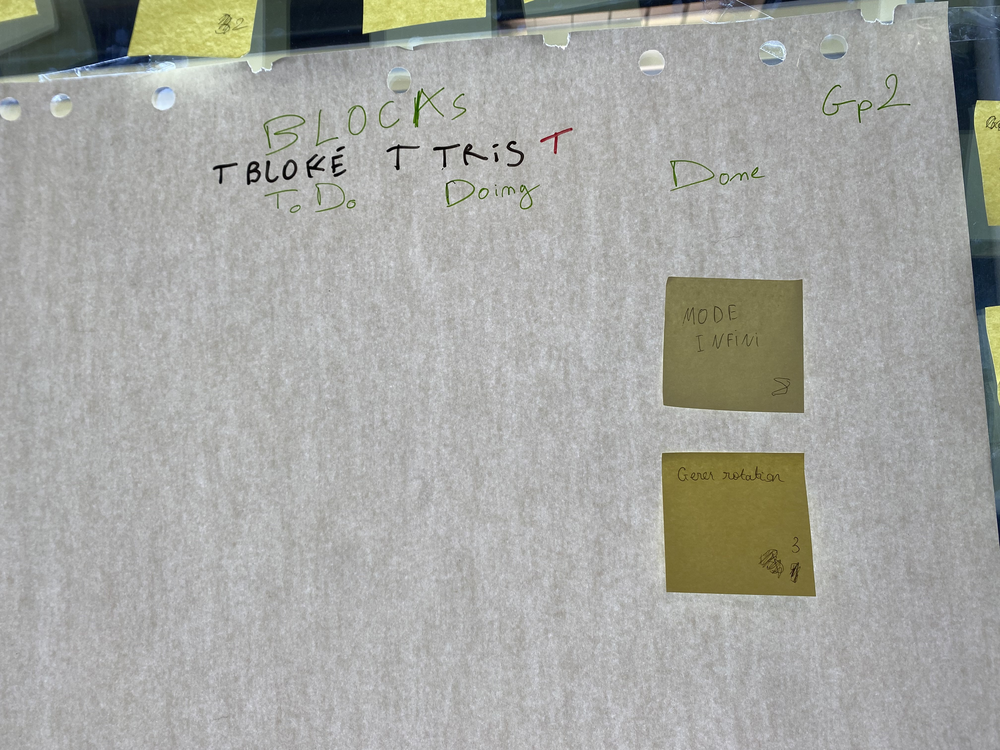

# Sprint 1

## Démo + Planification du sprint suivant

### Ce que nous avons fait durant ce sprint
Durant ce sprint, on a pu aborder les fonctionnalités de base du jeu, c'est-à-dire la création et l'affichage du plateau,des blocs etc.

### Ce que nous allons faire durant le prochain sprint

- Collaborer avec git.

- Gerer la chute des blocs dans une colonne.

- Gerer les Deplacement des blocs.
## Rétrospective

### Sur quoi avons nous butté ?

 - Difficulté à trouver notre structure de base
 - Difficulté sur git
 - Mauvaise gestion du temps donc nous avons pas pu terminé ce que nous nous somme engagé à faire.
 - pas de demo

### PDCA

De tous les éléments, celui qu'on veut améliorer est le Plan, on peut mésuser s'il s'améliore en vérifiant les résultats dans le check. On peut l'améliorer en surestimant le temps qu'une tache pourrait nous prendre afin d'être sur d'avoir bien le temps.

# Mémo

# Sprint 2

## Démo + Planification du sprint suivant
Nous n'avons pas pu presenté une demo a la fin de ce sprint par manque de temps on prevoit de finir la chute d'un bloc dans le prochain sprint.

### Ce que nous avons fait durant ce sprint

-le Menu du jeu
- Utilisation de structure de données
- Ecriture et sauvegarde dans des fichiers.

### Ce que nous allons faire durant le prochain sprint

- l'effacement des ligne 
- gerer le highscore
- gerer la chute d'un bloc dans un plateau
## Rétrospective

### Sur quoi avons nous butté ?
Nous avions besoin d'une base fondatrice pour notre projet. Cela nous a empeché d'avancer rapidement car uniquement une personne travaillait sur cette tâche. De plus, cette tâche etait plus longue que prévu.

### PDCA
Il y a eu un problème d'estimation de temps. De ce fait, nous avons complétement revu les tâches à réaliser pour les découper en plus petite tâches.

# Mémo

# Sprint 3

## Démo + Planification du sprint suivant
Comme démo, on a pu présenté un plateau de type tetris avec un la chute d'un bloc. on prevoit de gerer la collision des blocs dans le prochain sprint.

### Ce que nous avons fait durant ce sprint

- l'effacement des ligne 
- gerer le highscore
- gerer la chute d'un bloc dans un plateau

### Ce que nous allons faire durant le prochain sprint

- creer un beau décors
- affichage du score
- Gerer la collision des blocs

## Rétrospective

### Sur quoi avons nous butté ?

Durant ce sprint , nous n'avons pas réellement butté sur quoi-que ce soit, le fait d'avoir terminé la chute d'un bloc va nous permettre d'avancer beaucoup plus vite.Elle etait notre base fondatrice.

### PDCA
Il y a eu un problème de check durant les derniers sprints, nous n'avons pas pris le temps de faire des test unitaire après chaque tache on propose deux solution;

- de augmenter l'estimation du temps par les taches afin de les comptabiliser

- de prévoir une tache afin de faire tout les test unitaire durant un meme sprint.

# Mémo

# Sprint 4

## Démo + Planification du sprint suivant
On a pu présenté un plateau avec des blocs qui tombe sans arret comme à la tetris et qui s'empilent.

### Ce que nous avons fait durant ce sprint

- L'affichage du score 

- empiler des blocs

- connaitre et appliquer les execptions.

### Ce que nous allons faire durant le prochain sprint

- Mode infini

- Gerer ROTATION

- Perfectionnement du menu

- Gerer deplacement

## Rétrospective

### Sur quoi avons nous butté ?

on pense ne pas avoir eu de problème durant ce sprint. On n'a pas eu à identifier de problème , tout c'est dérouler comme prévu. on a pu finir ce que nous somme engagé à faire et on a pu présenté un demo.

### PDCA

# Mémo

# Sprint 5

## Démo + Planification du sprint suivant
On a pu présenté un plateau avec des blocs qui tombe sans arret comme à la tetris  qui s'empilent et se déplacent.

### Ce que nous avons fait durant ce sprint

- Gerer deplacement

### Ce que nous allons faire durant le prochain sprint

- Mode infini

- Gerer ROTATION

- Perfectionnement du menu

## Rétrospective

### Sur quoi avons nous butté ?

On pense ne pas avoir eu assez de temps ou mal gérer les estimations pour chaque tache, car on n'a pas pu finir les taches que nous nous sommes engagés à faire, mais on a pu présenter une démo avec des nouvelles fonctionnalités.

### PDCA

ob doit améliorer notre gestion du temps afin d'etre le plus efficace possible, on peut donc:

- l'améliorer en surestimant le temps qu'une tache pourrait nous prendre afin d'être sur d'etre dans les temps.

- Mieux répartir les taches afin d'etre le plus efficace possible.

# Mémo

# Sprint 6

## Démo + Planification du sprint suivant

### Ce que nous avons fait durant ce sprint

- Saisie utilisateur (Décrire ce que cela implique en termes de fonctionnalités ou d'interaction utilisateur.)

### Ce que nous allons faire durant le prochain sprint

- Gérer la rotation des blocs (Décrivez les détails de cette fonctionnalité.)
- Mode de jeu infini (Expliquez ce que signifie "infini" dans le contexte de votre jeu.)

## Rétrospective

### Sur quoi avons-nous buté ?

- Problèmes techniques (Identifiez spécifiquement les problèmes techniques que vous avez rencontrés.)
- Gestion du temps (Expliquez en quoi la gestion du temps a posé problème.)
- Gestion de Git (Détaillez les difficultés rencontrées avec Git.)

### PDCA

- Améliorer la gestion du temps en :
  - Estimant plus précisément la durée des tâches.
  - Planifiant suffisamment de temps pour les problèmes techniques imprévus.

- Améliorer la gestion de Git en :
  - Organisant des sessions de formation ou en recherchant des ressources pour l'équipe.
  - Mettant en place des pratiques de gestion de code plus structurées.

# Mémo

# Sprint 7

## Démo + Planification du sprint suivant

### Ce que nous avons fait durant ce sprint

- Gestion de la vitesse (Décrivez les fonctionnalités liées à la gestion de la vitesse.)
- Réglage de l'effacement des lignes (Expliquez les détails de cette fonctionnalité.)

### Ce que nous allons faire durant le prochain sprint

- Terminer la gestion de la rotation des blocs (Décrivez les détails de cette fonctionnalité.)
- Implémenter le mode de jeu infini (Expliquez ce que signifie "infini" dans le contexte de votre jeu.)

## Rétrospective

### Sur quoi avons-nous buté ?

- Gérer la rotation des blocs (Identifiez les problèmes spécifiques rencontrés lors de la gestion de la rotation.)
- Gestion du temps (Expliquez en quoi la gestion du temps a encore posé problème malgré les actions d'amélioration précédentes.)

### PDCA

- Améliorer la gestion du temps en :
  - Mieux décomposer les tâches liées à la gestion de la rotation des blocs.
  - Allouant suffisamment de temps pour les tests et la résolution de problèmes imprévus.

- Trouver des solutions pour la gestion de la rotation des blocs en :
  - Consacrant du temps à la recherche de solutions techniques spécifiques.
  - Envisageant de solliciter l'aide d'experts ou de pairs en cas de difficultés persistantes.

# Mémo

# Sprint 8

## Démo + Planification du sprint suivant

### Ce que nous avons fait durant ce sprint

- Implémentation du menu (Détaillez les fonctionnalités du menu.)
- Debug des couleurs (Expliquez les problèmes de couleurs que vous avez résolus.)
- Perfectionnement du menu (Décrivez les améliorations apportées au menu.)

### Ce que nous allons faire durant le prochain sprint

- Terminer la gestion de la rotation des blocs (Précisez les étapes restantes pour cette fonctionnalité.)
- Finaliser le mode de jeu infini (Expliquez les éléments à achever pour le mode infini.)

## Rétrospective

### Sur quoi avons-nous buté ?

- Rotation des blocs (Identifiez les problèmes spécifiques rencontrés lors de la gestion de la rotation malgré les tentatives précédentes.)
- Mode infini (Expliquez les défis qui persistent dans la mise en œuvre du mode infini.)

### PDCA

- Continuer à travailler sur la gestion de la rotation des blocs en :
  - Consacrant du temps à la résolution des problèmes techniques restants.
  - Recherchant des ressources ou une expertise externe si nécessaire.

- S'attaquer aux défis du mode infini en :
  - Analyser les problèmes existants de manière approfondie.
  - Consulter des références ou des exemples de code pour obtenir des idées sur la façon de résoudre ces problèmes.

# Mémo

# Sprint 9

## Démo + Planification du sprint suivant

### Ce que nous avons fait durant ce sprint

- Finalisation de la gestion de la rotation des blocs (Décrivez les fonctionnalités ou les corrections apportées.)
- Finalisation du mode infini (Expliquez les fonctionnalités du mode infini.)

## Rétrospective

### Sur quoi avons-nous buté ?

- (Dans ce sprint, nous n'avons pas rencontré de problèmes spécifiques.)

### PDCA

- Mieux prendre en compte les saisies utilisateur en :
  - Effectuant un examen approfondi des besoins des utilisateurs pour vous assurer de ne rien négliger.
  - Sollicitant des retours d'utilisateurs pour améliorer davantage les fonctionnalités basées sur les saisies utilisateur.
  - Et de mieux les prioriser afin de les finir en premier lieu

# Mémo

# groupe 2

Yliess El Atifi

