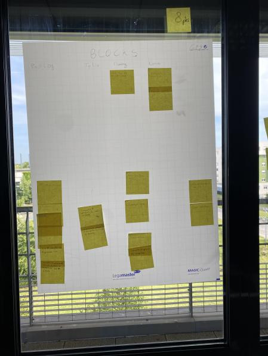
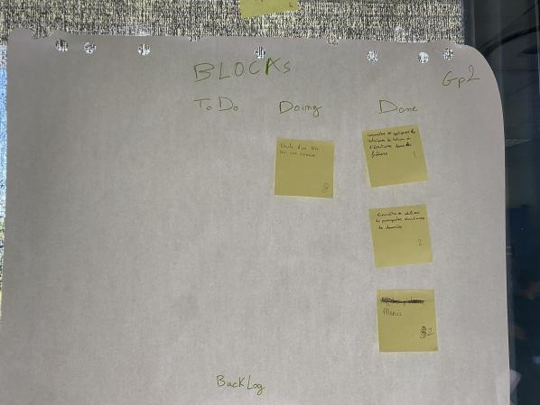
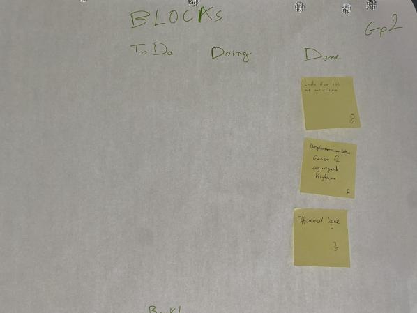

# Sprint 1

## Démo + Planification du sprint suivant

### Ce que nous avons fait durant ce sprint
Durant ce sprint, on a pu aborder les fonctionnalités de base du jeu, c'est-à-dire la création et l'affichage du plateau,des blocs

### Ce que nous allons faire durant le prochain sprint

- Collaborer avec git.

- Gerer la chute des blocs dans une colonne.

- Gerer les Deplacement des blocs.
## Rétrospective

### Sur quoi avons nous butté ?

 - Difficulté à trouver notre structure de base
 - Difficulté sur git
 - Mauvaise gestion du temps donc nous avons pas pu terminé ce que nous nous somme engagé à faire.
 - pas de demo

### PDCA

De tous les éléments, celui qu'on veut améliorer est le Plan, on peut mésuser s'il s'améliore en vérifiant les résultats dans le check. On peut l'améliorer en surestimant le temps qu'une tache pourrait nous prendre afin d'être sur d'avoir bien le temps.

# Mémo

# Sprint 2

## Démo + Planification du sprint suivant

### Ce que nous avons fait durant ce sprint

-le Menu du jeu
- Utilisation de structure de données
- Ecriture et sauvegarde dans des fichiers.

### Ce que nous allons faire durant le prochain sprint

- l'effacement des ligne 
- gerer le highscore
- gerer la chute d'un bloc dans un plateau
## Rétrospective

### Sur quoi avons nous butté ?
Nous avions besoin d'une base fondatrice pour notre projet. Cela nous a empeché d'avancer rapidement car uniquement une personne travaillait sur cette tâche. De plus, cette tâche etait plus longue que prévu.

### PDCA
Il y a eu un problème d'estimation de temps. De ce fait, nous avons complétement revu les tâches à réaliser pour les découper en plus petite tâches.

# Mémo

# Sprint 3

## Démo + Planification du sprint suivant

### Ce que nous avons fait durant ce sprint

- l'effacement des ligne 
- gerer le highscore
- gerer la chute d'un bloc dans un plateau

### Ce que nous allons faire durant le prochain sprint

- creer un beau décors
- affichage du score
- Gerer la collision des blocs

## Rétrospective

### Sur quoi avons nous butté ?

Durant ce sprint , nous n'avons pas réellement butté sur quoi-que ce soit, le fait d'avoir terminé la chute d'un bloc va nous permettre d'avancer beaucoup plus vite.Elle etait notre base fondatrice.

### PDCA
Il y a eu un problème de check durant les derniers sprints, nous n'avons pas pris le temps de faire des test unitaire après chaque tache on propose trois solution;
- de augmenter l'estimation du temps par les taches afin de les comptabiliser

- de prévoir une tache afin de faire tout les test unitaire durant un meme sprint.

# Mémo

# Sprint 4

## Démo + Planification du sprint suivant

### Ce que nous avons fait durant ce sprint

### Ce que nous allons faire durant le prochain sprint

## Rétrospective

### Sur quoi avons nous butté ?

### PDCA

# Mémo

