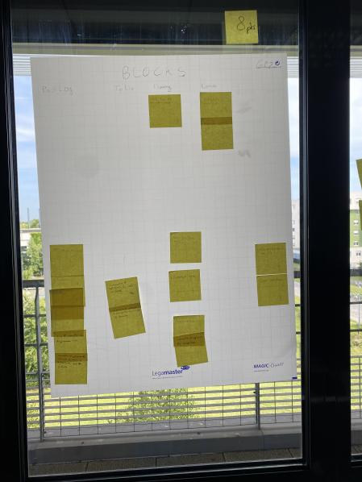

# Sprint 1

## Démo + Planification du sprint suivant

### Ce que nous avons fait durant ce sprint
Durant ce sprint, on a pu aborder les fonctionnalités de base du jeu, c'est-à-dire la création et l'affichage du plateau,des blocs

### Ce que nous allons faire durant le prochain sprint

-collaborer avec git.

-gerer la chute des blocs dans une colonne.

-Gerer les Deplacement des blocs.
## Rétrospective

### Sur quoi avons nous butté ?

 - Difficulté à trouver notre structure de base
 - Difficulté sur git
 - Mauvaise gestion du temps donc nous avons pas pu terminé ce que nous nous somme engagé à faire.
 - pas de demo

### PDCA

De tous les éléments, celui qu'on veut améliorer est le Plan, on peut mésuser s'il s'améliore en vérifiant les résultats dans le check. On peut l'améliorer en surestimant le temps qu'une tache pourrait nous prendre afin d'être sur d'avoir bien le temps.

# Mémo
